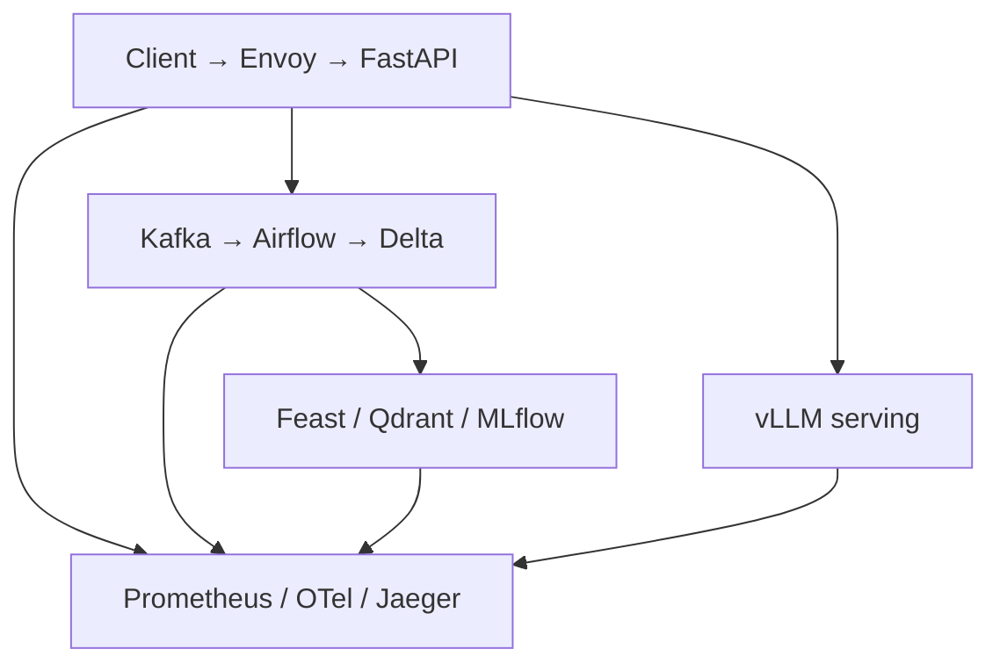

# Architecture and Individual Ownership

## Thông tin

- Họ và tên: Nguyễn Trường An
- Mã sinh viên: 2A202601151
- Hình thức: Cá nhân

Sơ đồ kiến trúc chính thức: [docs/images/lab28-architecture-overview.png](docs/images/lab28-architecture-overview.png).

## Ownership cá nhân

| Vai trò | IP | Trách nhiệm và bằng chứng |
|---|---|---|
| Ingestion & Orchestration | IP01–IP02 | Event/header contract, topics, retry, DLQ, Airflow run |
| Data & ML | IP03–IP04–IP06 | Dedupe, Delta history, Feast entity, MLflow champion/rollback |
| Serving & Retrieval | IP05–IP07 | Stable vector IDs, search result, grounded prompt, vLLM identity |
| Platform & Observability | IP08–IP10 | Envoy route/rate limit, targets/dashboard/alert, trace continuity |
| Incident Commander | J1–J5 | Demo order, failure prediction, recovery và no-data-loss proof |

Toàn bộ vai trò do Nguyễn Trường An phụ trách vì đây là bài làm cá nhân. Mỗi
evidence phải chứa ID/version và được tạo từ lần chạy thật tương ứng.
